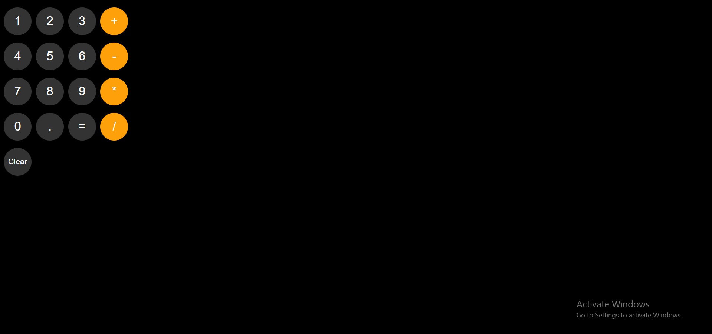

# 🧮 Calculator

A simple and responsive calculator built using **HTML**, **CSS**, and **JavaScript**. This project performs basic arithmetic operations with a clean, modern dark-themed interface. It was built to practice JavaScript fundamentals, DOM manipulation, and event handling.

## 🌐 Live Demo

👉 https://rohitkumar1144.github.io/Calculator/

---

## 📸 Preview



---

## ✨ Features

- Perform basic arithmetic operations
  - Addition (+)
  - Subtraction (-)
  - Multiplication (×)
  - Division (÷)
- Decimal number support
- Clear button to reset calculations
- Dark-themed modern UI
- Instant calculation updates using JavaScript

---

## 🛠️ Technologies Used

- HTML5
- CSS3
- JavaScript (ES6)

---

## 📂 Project Structure

```
Calculator/
│── index.html
│── script.js
│── README.md
│
├── styles/
│   └── calculator.css
│
└── images/
    └── homepage.png
```

---

## 🚀 Getting Started

### Clone the repository

```bash
git clone https://github.com/RohitKumar1144/Calculator.git
```

### Navigate to the project folder

```bash
cd Calculator
```

### Run the project

Simply open `index.html` in your browser, or use the **Live Server** extension in VS Code for a better development experience.

---

## 📚 What I Learned

This project helped me improve my understanding of:

- HTML page structure
- CSS styling and layouts
- JavaScript fundamentals
- DOM manipulation
- Event handling
- Building interactive web applications
- Writing clean and organized code

---

## 🚀 Future Improvements

- Keyboard support
- Backspace/Delete button
- Percentage (%) operation
- Positive/Negative (±) toggle
- Calculation history
- Scientific calculator functions
- Improved mobile responsiveness

---

## 🤝 Contributing

Contributions are welcome!

If you'd like to improve this project, feel free to fork the repository and submit a pull request.

---

## 👨‍💻 Author

**Rohit Kumar**

- GitHub: https://github.com/RohitKumar1144

---

## ⭐ Support

If you found this project helpful, consider giving it a **⭐ Star** on GitHub!
